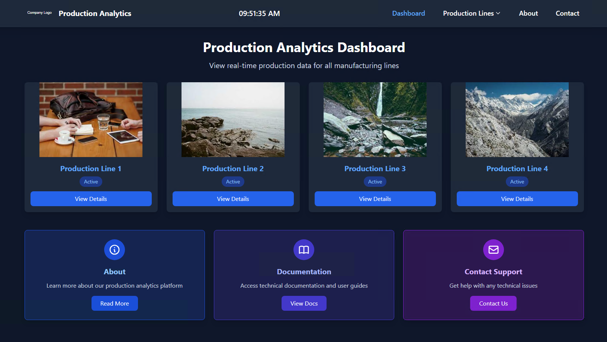

# Carousel Website

## Overview
This project is a carousel website designed for displaying production analytics. It features multiple pages that provide information about different production lines, a contact form for user inquiries, and a thank-you page for form submissions.

## Project Structure
```
carousel-website
├── index.html               # Main dashboard displaying KPIs for Line 1
├── styles.css               # CSS styles for the website
├── scripts.js               # Initializes slideshow and time display functionality
├── Pages                    # Contains HTML pages for different sections
│   ├── about.html           # Information about the production system
│   ├── contact.html         # Contact form for user inquiries
│   ├── thankyou.html        # Confirmation page after form submission
│   ├── line1.html           # Page for Line 1 KPIs
│   ├── line2.html           # Page for Line 2 KPIs
│   ├── line3.html           # Page for Line 3 KPIs
│   └── line4.html           # Page for Line 4 KPIs
├── scripts                  # Contains JavaScript files for functionality
│   ├── slideshow.js         # JavaScript for the main slideshow
│   └── utils.js            # Utility functions, such as updating the current time
├── Resources                # Contains resources like images and logos
│   ├── images               # Dummy images for the carousel
│   │   ├── image1.jpg
│   │   ├── image2.jpg
│   │   ├── image3.jpg
│   │   ├── image4.jpg
│   │   └── image5.jpg
│   └── logo                 # Company logo
│       └── company-logo.svg
├── web.config               # Configuration file for web server settings
└── README.md                # Documentation for the project
```

## Setup Instructions
1. **Clone the Repository**: Clone this repository to your local machine.
2. **Open in Browser**: Open `index.html` in your web browser to view the main dashboard.
3. **Navigate Pages**: Use the navigation links to access different pages, including the contact form and production line KPIs.
4. **Contact Form**: Fill out the contact form to reach out to the IT team. Upon submission, you will be redirected to the thank-you page.

## Features
- **Responsive Design**: The website is designed to be responsive and works well on various screen sizes.
- **Image Carousel**: The main dashboard features an image carousel that cycles through dummy images.
- **Dynamic Time Display**: The current time is displayed and updated in real-time.
- **Multiple Production Lines**: Separate pages for each production line (Line 1 to Line 4) to display relevant KPIs.

## Contribution
Feel free to contribute to this project by submitting issues or pull requests. Your feedback and suggestions are welcome!

